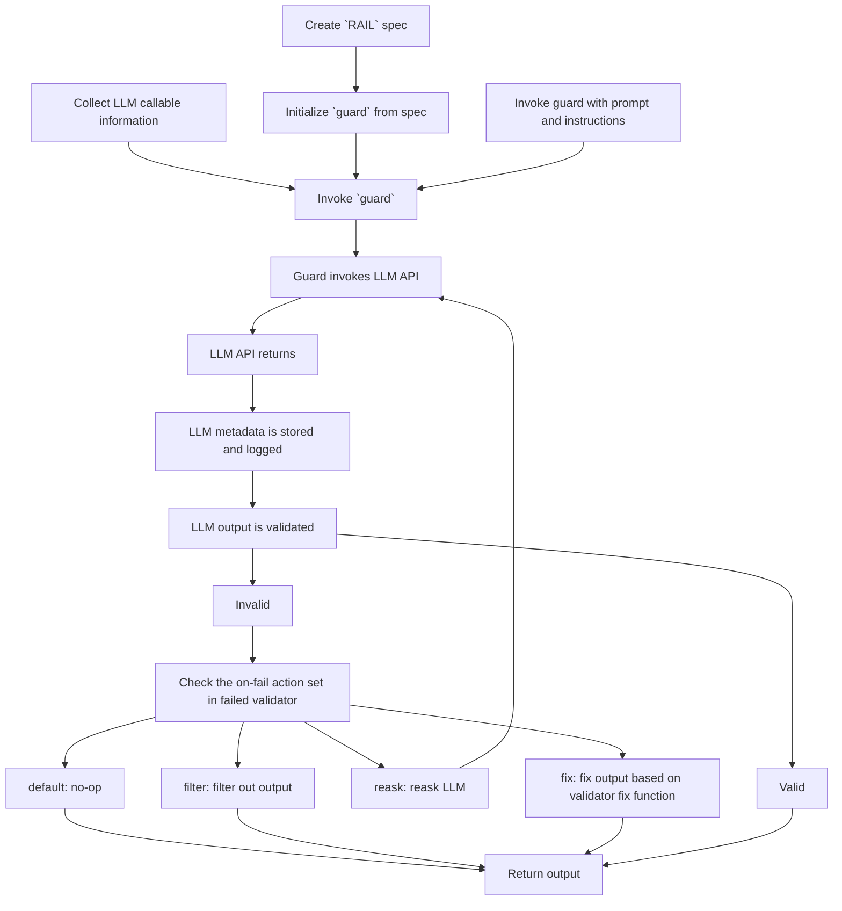

# Guard

The guard object is the main interface for GuardRails. It is seeded with a RailSpec, and then used to run the GuardRails AI engine. It is the object that accepts changing prompts, wraps LLM prompts, and keeps track of call history.

## How it works

