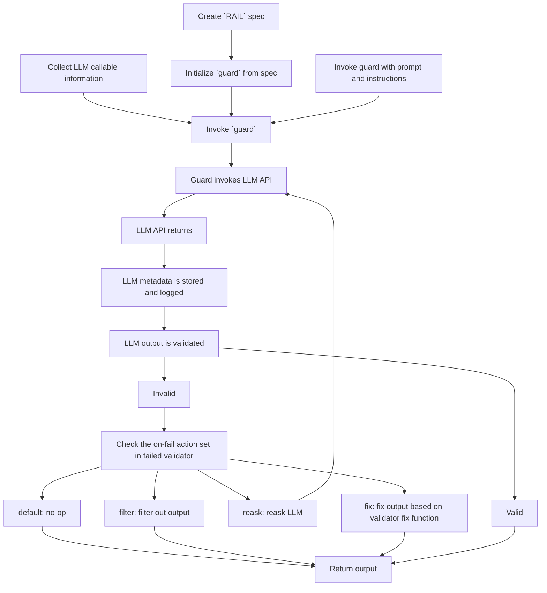

# Guard


The guard object is the main interface for GuardRails. It is seeded with a RailSpec, and then used to run the GuardRails AI engine. It is the object that accepts changing prompts, wraps LLM prompts, and keeps track of call history.


## How it works



## Two main flows
__call__
parse

## Outputs

## Error Handling and Retries
GuardRails currently performs automatic retries with exponential backoff when any of the following errors occur when calling the LLM:
    - openai.error.APIConnectionError
    - openai.error.APIError
    - openai.error.TryAgain
    - openai.error.Timeout
    - openai.error.RateLimitError
    - openai.error.ServiceUnavailableError

Note that this list is not exhaustive of the possible errors that could occur.  In the event that errors other than these arise during LLM calls, an exception will be raised.  The messaging of this exception is intended to help troubleshoot common problems, especially with custom LLM wrappers, as well as communicate the underlying error.  This type of exception would look like the following:
```log
Received an exception when calling with_handling:  The callable `fn` passed to `Guard(fn, ...)` failed with the following error: `{Root error message here!}`. Make sure that `fn` can be called as a function that takes in a single prompt string and returns a string.
```

In situations where the exception can be handled and retried, that is the exception is in the list above, the call to the LLM will be retried with exponential backoff until a max wait time between requests of sixty (60) seconds is reached.