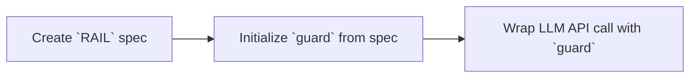

# Guardrails AI

## 🛤️ What is Guardrails AI?

Guardrails AI is the leading open-source framework to define and enforce assurance for LLM applications. It offers

✅ Framework for creating custom validations at an application level

✅ Orchestration of prompting → verification → re-prompting

✅ Library of commonly used validators for multiple use cases

✅ Specification language for communicating requirements to LLM

## 🚒 Under the hood

Guardrails provides an object definition called a `Rail` for enforcing a specification on an LLM output, and a lightweight wrapper called a `Guard` around LLM API calls to implement this spec.

1. `rail` (**R**eliable **AI** markup **L**anguage) files for specifying structure and type information, validators and corrective actions over LLM outputs. The concept of a Rail has evolved from markup - Rails can be defined in either <a href='/docs/defining_guards/pydantic'>Pydantic</a> or <a href='/docs/how_to_guides/rail'>RAIL</a> for structured outputs, or directly in <a href='/docs-graveyard/defining_guards/strings.ipynb'>Python</a> for string outputs.
2. `Guard` wraps around LLM API calls to structure, validate and correct the outputs.

Check out the [Getting Started](/docs/guardrails_ai/getting_started) guide to learn how to use Guardrails.

## 📍 Roadmap

- [ ] Javascript SDK
- [ ] Wider variety of language support (TypeScript, Go, etc)
- [ ] Informative logging
- [ ] VSCode extension for `.rail` files
- [ ] Next version of `.rail` format
- [ ] Validator playground
- [x] Input Validation
- [x] Pydantic 2.0
- [x] Improving reasking logic
- [x] Integration with LangChain
- [x] Add more LLM providers
