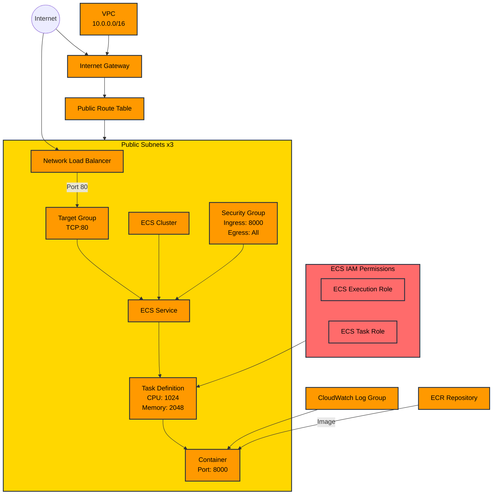

# Continuous Integration and Deployment - AWS
Guardrails allows you to deploy a dedicated server to run guard executions while continuing to use the Guardrails SDK as you do today.

In this guide we show an example of deploying a containerized version of Guardrails API into AWS leveraging AWS ECS. 

:::note
- Read the quick start guide on using Guardrails on the server [here](https://www.guardrailsai.com/docs/getting_started/guardrails_server)
- Find generalized information on deploying Guardrails [here](https://www.guardrailsai.com/docs/concepts/deploying)
:::
## Step 1: Containerizing Guardrails API

### Updating Guardrails config + guard/validator definitions

Guardrails supports creating Guards from templates. They can come from the [Guardrails Hub](https://hub.guardrailsai.com/guard-templates). 

```bash
# use Guardrails pre-defined template
mkdir guardrails

cd guardrails

guardrails create --template hub:template://guardrails/chatbot
```

Running the command above will create 2 local artifacts a`config.py` and `chatbot.json` which is referenced in the config. The chatbot.json contains definitions for guards, validators and validator configurations. Each entry in guards is equivalent to a JSON serialization of guard.to_dict()

A simple example is below.

```python
{
  "name": "chatbot",
  "description": "guard to validate chatbot output",
  "template_version": "0.0.1",
  "namespace": "guardrails",
  "guards": [
    {
      "id": "chatbot",
      "name": "chatbot",
      "validators": [
        {
          "id": "guardrails/detect_pii",
          "on": "$",
          "onFail": "exception",
          "kwargs": {
            "pii_entities": ["PERSON"]
          }
        }
      ]
    }
  ]
}

```

A template can also be a local json file with the format above. A config for it can be generated via the command below.

```python
guardrails create --template chatbot.json
```

The validator arguments and entries can be updated manually or programmatically. 

For example we could update kwargs to only identify and fix location.

```python
"kwargs": {
		"pii_entities":["PERSON", "LOCATION"]
}
```

It is recommended to keep a requirements.txt or equivalent project dependencies file and template json in source control to allow CI/CD, targeted deployments and rollback. config.py is automatically generated. In some cases config.py might need to be customized. A customized config.py should be kept in source control and COPY’ed in the docker build step (skipping a guardrails create step that would overwrite it). 

### Container Build

Building a guard can be achieved with docker. An example build file is below. It is recommended to keep the Dockerfile also in source control. Create a `Dockerfile` in a new working directory `guardrails` (or alternative) 

```python
FROM python:3.12-slim

ARG GUARDRAILS_TOKEN
ARG GUARDRAILS_SDK_VERSION="guardrails-ai[api]>=0.5.0,<6"

# Set environment variables to avoid writing .pyc files and to unbuffer Python output
ENV PYTHONDONTWRITEBYTECODE=1
ENV PYTHONUNBUFFERED=1
# These are purposefully low for initialization and development
# set to WARN or higher in production
ENV LOGLEVEL="DEBUG"
ENV GUARDRAILS_LOG_LEVEL="DEBUG"
ENV APP_ENVIRONMENT="production"

WORKDIR /app

# Install Git and necessary dependencies
RUN apt-get update && \
    apt-get install -y git curl gcc jq && \
    apt-get clean && \
    rm -rf /var/lib/apt/lists/*

RUN pip install --upgrade pip

# Install guardrails, the guardrails API, and gunicorn
RUN pip install $GUARDRAILS_SDK_VERSION "gunicorn"

RUN guardrails configure --enable-metrics --enable-remote-inferencing --token $GUARDRAILS_TOKEN

# bring in base template
COPY guardrails/chatbot.json /app/chatbot.json

# un comment this and comment out the RUN guardrails create if using a customized config.py
# COPY guardrails/config.py

# Install Hub Deps and create config.py
RUN guardrails create --template /app/chatbot.json

# Expose port 8000 for the application
EXPOSE 8000

# Command to start the Gunicorn server with specified settings
CMD ["gunicorn", "--bind", "0.0.0.0:8000", "--timeout=5", "--threads=3", "guardrails_api.app:create_app()"]

```

The container above can be built and run locally with the following commands

```bash
docker build -t gr-backend-images:latest --no-cache --progress=plain --build-arg GUARDRAILS_TOKEN=[YOUR GUARDRAILS TOKEN] .
# if running into issues on m based Apple Macs try forcing the build platform with --platform linux/amd64 
docker run -d -p 8000:8000 -e OPENAI_API_KEY=[YOUR OPENAI KEY] gr-backend-images:latest
```

## Step 2: Verification

Verification of guards should be done as programmatically as possible. Here is an example pytest that can test server based guards in a variety of ways. It is configured to run against the container above and do some basic tests around validation and integration with an llm. 

```python


import openai
import os
import pytest
from guardrails import Guard, settings

# OpenAI compatible Guardrails API Guard
openai.base_url = "http://127.0.0.1:8000/guards/chatbot/openai/v1/"

# the client requires this but we will use the key the server is already seeded with
# this does not need to be set as we will be proxying all our llm interaction through
# guardarils server
openai.api_key = os.getenv("OPENAI_API_KEY") or 'some key'

@pytest.mark.parametrize(
    "mock_llm_output, validation_output, validation_passed, error", [
        ("Paris is wonderful in the spring", "Paris is wonderful in the spring", False, True),
        ("Here is some info. You can find the answers there.","Here is some info. You can find the answers there.", True, False)
    ]
)
def test_guard_validation(mock_llm_output, validation_output, validation_passed, error):
    settings.use_server = True
    guard = Guard(name="chatbot")
    if error:
        with pytest.raises(Exception) as e:
            validation_outcome = guard.validate(mock_llm_output)
    else:
        validation_outcome = guard.validate(mock_llm_output)
        assert validation_outcome.validation_passed == validation_passed
        assert validation_outcome.validated_output == validation_output

@pytest.mark.parametrize(
    "message_content, output, validation_passed, error",[
        ("Tell me about Paris in a 10 word or less sentence", "Romantic, historic",False, True),
        ("Write a sentence using the word banana.", "banana", True, False)
    ]
)
def test_server_guard_llm_integration(message_content, output, validation_passed, error):
    settings.use_server = True
    guard = Guard(name="chatbot")
    messages =[
        {
            "role":"user",
            "content": message_content
        }
    ]
    if error:
        with pytest.raises(Exception):
            validation_outcome = guard(
                model="gpt-4o-mini",
                messages=messages,
                temperature=0.0,
            )
    else:
        validation_outcome = guard(
            model="gpt-4o-mini",
            messages=messages,
            temperature=0.0,
        )
        assert(output) in validation_outcome.validated_output
        assert(validation_outcome.validation_passed) is validation_passed

@pytest.mark.parametrize(
    "message_content, output, validation_passed, error",[
        ("Tell me about Paris in 5 words", "Romantic, historic",True, False),
        ("Write a sentence about a persons first day", "On her first day at the new job, she felt a mix of excitement and nerves as she stepped into the bustling office, ready to embrace the challenges ahead.", True, False)
    ]
)
def test_server_openai_llm_integration(message_content, output, validation_passed, error):
    messages =[
        {
            "role":"user",
            "content": message_content
        }
    ]
    if error:
        with pytest.raises(Exception) as e:
            completion = openai.chat.completions.create(
                model="gpt-4o-mini",
                messages=messages,
                temperature=0.0,
            )
        assert "Validation failed for field with errors: Found internal domains:" in str(e)
    else:
        completion = openai.chat.completions.create(
            model="gpt-4o-mini",
            messages=messages,
            temperature=0.0,
        )
        assert(output) in completion.choices[0].message.content
        assert(completion.guardrails['validation_passed']) is validation_passed


```
## Step 3: Deploying Infrastructure

By leveraging AWS ECS we can scale to handle increasing workloads by scaling the number of containers. Furthermore we can leverage a streamlined deployment process using ECS with rolling updates (Step 3).

We can now deploy the infrastructure needed for AWS ECS which includes:
- Networking Resources (VPC, Load Balancer, Security Groups, Subnets, ect)
- IAM Roles & Policies (ECS Task & Execution Role)
- ECS Cluster (ECS Service, Task, Task Definition)

We start by initilizing terraform with:

```bash
terraform init
```

One can then copy the provided [Terraform Code](#terraform) or use their own by placing into our working directory and running:

```bash
terraform apply -var="aws_region=us-east-1" -var="backend_memory=2048" -var="backend_cpu=1024" -var="desired_count=0"
```

> Each can be configured based on your requirements. `desired_count` corresponds to the number of containers that should always be running. Alternatively one can configure a minimum & maximum count with some autoscaling policy. It is initially set to `0` since we have yet to upload the container to the AWS container registry (ECR).

Once the deployment has succeeded you should see some output values (which will be required if you wish to set up CI).


## Step 4: Deploying Guardrails API
### Manual

Firstly, create or use your existing guardrails token and export it to your current shell `export GUARDRAILS_TOKEN="..."`

```bash
# Optionally use the command below to use your existing token
export GUARDRAILS_TOKEN=$(cat ~/.guardrailsrc| awk -F 'token=' '{print $2}' | awk '{print $1}' | tr -d '\n')
```

Run the following to build your container and push up to ECR:

```bash
# Build Container
docker build --platform linux/amd64 --build-arg GUARDRAILS_TOKEN=$GUARDRAILS_TOKEN -t gr-backend-images:latest .

# Push to ECR
aws ecr get-login-password --region ${YOUR_AWS_REGION} | docker login --username AWS --password-stdin ${YOUR_AWS_ACCOUNT_ID}.dkr.ecr.${YOUR_AWS_REGION}.amazonaws.com
docker tag guardrails-api:latest ${YOUR_AWS_ACCOUNT_ID}.dkr.ecr.${YOUR_AWS_REGION}.amazonaws.com/gr-backend-images:latest
docker push ${YOUR_AWS_ACCOUNT_ID}.dkr.ecr.${YOUR_AWS_REGION}.amazonaws.com/gr-backend-images:latest
```

### Github Actions
Deployment can vary depend on hosting infrastructure and environment. For AWS we recommend using a service like ECS and triggering no down time rolling deployments via something like Github actions.

An example Github action is below for automated builds, verification and deployment. 

```yaml
name: CI

on:
    push:
        branches:
            - main
    pull_request:
        branches:
            - main

jobs:
    build:
        runs-on: ubuntu-latest
        steps:
            - name: Check out head
              uses: actions/checkout@v3
              with:
                persist-credentials: false

            - name: Set up QEMU
              uses: docker/setup-qemu-action@master
              with:
                platforms: linux/amd64

            - name: Set up Docker Buildx
              uses: docker/setup-buildx-action@master
              with:
                platforms: linux/amd64

            - name: Build Docker image
              uses: docker/build-push-action@v6
              with:
                context: guard
                file: guard/Dockerfile
                platforms: linux/amd64
                push: false
                tags: gr-backend-images:${{ github.sha }}
                load: true
                build-args: |
                  GUARDRAILS_TOKEN=${{ secrets.GUARDRAILS_API_KEY }}
            
            - name: Save Docker image as artifact
              run: |
                docker save gr-backend-images:${{ github.sha }} -o guardrails_image.tar

            - name: Upload Docker image artifact
              uses: actions/upload-artifact@v2
              with:
                name: guardrails_image
                path: guardrails_image.tar

    test:
        runs-on: ubuntu-latest
        needs: build
        steps:
            - name: Check out head
              uses: actions/checkout@v3
              with:
                persist-credentials: false

            - name: Set up QEMU
              uses: docker/setup-qemu-action@master
              with:
                platforms: linux/amd64

            - name: Download Docker image artifact
              uses: actions/download-artifact@v2
              with:
                name: guardrails_image
                path: .
        
            - name: Load Docker image
              run: |
                docker load -i guardrails_image.tar

            - name: Start Docker container
              run: |
                  docker run -d --name guardrails-container -p 8000:8000 -e OPENAI_API_KEY=${{ secrets.OPENAI_API_KEY }} gr-backend-images:${{ github.sha }}
        
            - name: Wait for Docker container to be ready
              run: |
                for i in {1..30}; do
                if docker exec guardrails-container curl -s http://localhost:8000/; then
                    echo "Server is up!"
                    break
                fi
                echo "Waiting for server..."
                sleep 5
                done
    
            - name: Run Pytest
              run: |
                pip install pytest openai guardrails-ai
                pytest guard/tests
                docker stop guardrails-container
                docker rm guardrails-container

    deploy:
        runs-on: ubuntu-latest
        needs: test
        if: github.ref == 'refs/heads/main'
        steps:
            - name: Check out head
              uses: actions/checkout@v3
              with:
                persist-credentials: false
    
            - name: Download Docker image artifact
              uses: actions/download-artifact@v2
              with:
                name: guardrails_image
                path: .
        
            - name: Load Docker image
              run: |
                docker load -i guardrails_image.tar
    
            - name: Retag and push Docker image
              run: |
                docker tag gr-backend-images:${{ github.sha }} gr-backend-images:latest
                echo "something like docker push ${YOUR_AWS_ACCOUNT_ID}.dkr.ecr.${YOUR_AWS_REGION}.amazonaws.com/gr-backend-images:latest"
            - name: Deploy to production
              run: |
                echo "Deploying to production. This is typically a ecs update for aws."
                echo "like `aws ecs update-service --cluster ${{ env.AWS_ECS_CLUSTER_NAME }} --service ${{ env.AWS_ECS_SERVICE_NAME }} --desired-count ${{ env.AWS_ECS_DESIRED_TASK_COUNT }} --force-new-deployment`"
              env:
                AWS_DEFAULT_REGION: ${{ env.AWS_REGION }}
```

## Deployment/Update Frequency

Generally guardrails core lib and validators are updated on a very regular basis(weekly) with bug fixes, security fixes and non breaking feature updates. Every release is accompanied by release notes [here](https://github.com/guardrails-ai/guardrails/releases). Large releases with breaking changes happen at a slower cadence and will be accompanied with migration guides [here](/docs/migration_guides/0-5-migration).  It is recommended to update on a semi-regular basis  utilizing a CI/CD flow like the one outlined in this document. With the recommended steps below:

1. Update the guardrails version tag
2. Follow any migration guides that need to be applied
3. Run build locally and verify tests pass
4. Commit updates to source control
5. Source control changes are approved and merged to main
6. Github action triggers and updates are deployed

## Remote Inference

Validators that use llms and other models can often gain a large performance boost from running their inferences in batches on dedicated hardware with dedicated accelerators. It is also often advantageous to scale this infrastructure independently of the core guards and validators. 

Many guardrails validators support remote inference for development purposes  for free and it can be toggled locally via `guardrails configure` and answering Y to enabling remote inference.

See more general information about remote inference [here](/docs/how_to_guides/hosting_validator_models).

## Using with SDK

You should be able to get the URL for your Guardrails API using:

```bash
export GUARDRAILS_BASE_URL=$(terraform output -raw backend_service_url)
echo "http://$GUARDRAILS_BASE_URL"
```

By setting the above environment variable `GUARDRAILS_BASE_URL` the SDK will be able to use this as a backend for running validations.

## Quick Start Repository Template

We've conveniently packaged all the artifacts from this document in a github repository that can be used as a template for your own verification and deployment [here](https://github.com/guardrails-ai/continuous_integration_and_deployment_aws_template).

## Diagram



## Terraform

```hcl
locals {
    deployment_name = "gr-backend"   
}

variable "aws_region" {
  description = "AWS region to deploy the resources"
  type        = string
  default     = "us-east-2"
}

variable "backend_cpu" {
  description = "CPU units for the service"
  type        = number
  default     = 1*1024
}

variable "backend_memory" {
  description = "Memory units for the service"
  type        = number
  default     = 2*1024
}

variable "backend_server_port" {
    description = "Port on which the backend server listens"
    type        = number
    default     = 8000
}

variable "desired_count" {
    description = "Number of tasks to run"
    type        = number
    default     = 0
}

provider "aws" {
  region = var.aws_region

  default_tags {
    tags = {
      Offering    = "Guardrails Backend"
      Vendor      = "Guardrails"
      Terraform   = "True"
    }
  }
}

################# Networking Resources

data "aws_availability_zones" "available" {}


resource "aws_vpc" "backend" {
  cidr_block            = "10.0.0.0/16"
  enable_dns_hostnames  = true

  tags = {
    Name = "${local.deployment_name}-vpc"
  }
}

resource "aws_subnet" "backend_public_subnets" {
  count = 3
  vpc_id = aws_vpc.backend.id
  cidr_block              = cidrsubnet("10.0.0.0/16", 8, count.index)
  availability_zone       = data.aws_availability_zones.available.names[count.index]
  map_public_ip_on_launch = true

  tags = {
    Name = "${local.deployment_name}-public-subnet-${count.index}"
  }
}

resource "aws_eip" "backend" {
  count      = 2
  vpc        = true
  depends_on = [aws_internet_gateway.backend]
}

resource "aws_nat_gateway" "backend" {
  count         = 2
  subnet_id     = aws_subnet.backend_public_subnets[count.index].id
  allocation_id = aws_eip.backend[count.index].id
}

resource "aws_internet_gateway" "backend" {
  vpc_id = aws_vpc.backend.id

  tags = {
    Name = "${local.deployment_name}-igw"
  }
}

resource "aws_route_table" "backend_public_routes" {
  vpc_id = aws_vpc.backend.id

  route {
    cidr_block = "0.0.0.0/0"
    gateway_id = aws_internet_gateway.backend.id
  }
}

resource "aws_route_table_association" "backend_public_routes" {
  count          = length(aws_subnet.backend_public_subnets)
  subnet_id      = aws_subnet.backend_public_subnets[count.index].id
  route_table_id = aws_route_table.backend_public_routes.id
}

resource "aws_lb" "app_lb" {
  name                             = "${local.deployment_name}-nlb"
  load_balancer_type               = "network"
  internal                         = false
  subnets                          = aws_subnet.backend_public_subnets[*].id
  enable_cross_zone_load_balancing = false
}

resource "aws_lb_listener" "app_lb_listener" {
  load_balancer_arn = aws_lb.app_lb.arn

  protocol = "TCP"
  port     = 80

  default_action {
    type             = "forward"
    target_group_arn = aws_lb_target_group.app_lb.arn
  }
}

resource "aws_lb_target_group" "app_lb" {
  name        = "${local.deployment_name}-nlb-tg"
  protocol    = "TCP"
  port        = var.backend_server_port
  vpc_id      = aws_vpc.backend.id
  target_type = "ip"

  health_check {
    healthy_threshold   = "2"
    interval            = "30"
    protocol            = "HTTP"
    timeout             = "3"
    unhealthy_threshold = "3"
    path                = "/"
    port                = var.backend_server_port
  }

  lifecycle {
    create_before_destroy = true
  }
}

resource "aws_security_group" "backend" {
  name        = "${local.deployment_name}-firewall"
  description = "Guardrails backend firewall"
  vpc_id      = aws_vpc.backend.id

  ingress {
    description = "Guardrails API Access"
    from_port   = var.backend_server_port
    to_port     = var.backend_server_port
    protocol    = "tcp"
    cidr_blocks = ["0.0.0.0/0"]
  }

  egress {
    description = "Allow all outbound traffic"
    from_port   = 0
    to_port     = 0
    protocol    = "-1"
    cidr_blocks = ["0.0.0.0/0"]
  }

  revoke_rules_on_delete = true
}

################# Log Resources

resource "aws_cloudwatch_log_group" "backend_log_group" {
  name              = "${local.deployment_name}-log-group"
  retention_in_days = 30
}

################# Application Resources

resource "aws_ecr_repository" "backend_images" {
  name = "${local.deployment_name}-images"
}

resource "aws_ecs_cluster" "backend" {
  name = "${local.deployment_name}-ecs-cluster"

  configuration {
    execute_command_configuration {
      logging    = "OVERRIDE"

      log_configuration {
        cloud_watch_encryption_enabled = false
        cloud_watch_log_group_name     = aws_cloudwatch_log_group.backend_log_group.name
      }
    }
  }

  setting {
    name  = "containerInsights"
    value = "enabled"
  }
}

data "aws_caller_identity" "current" {}

resource "aws_ecs_task_definition" "backend" {
  family                = "${local.deployment_name}-backend-task-defn"
  execution_role_arn    = aws_iam_role.ecs_execution_role.arn
  task_role_arn         = aws_iam_role.ecs_task_role.arn
  network_mode          = "awsvpc"
  requires_compatibilities = ["FARGATE"]
  cpu                   = var.backend_cpu
  memory                = var.backend_memory

  container_definitions = jsonencode([
    {
      name             = "${local.deployment_name}-task",
      image            = "${aws_ecr_repository.backend_images.repository_url}:latest",
      cpu              = var.backend_cpu,
      memory           = var.backend_memory,
      networkMode      = "awsvpc",

      portMappings     = [
        {
          containerPort = var.backend_server_port,
          hostPort      = var.backend_server_port,
          protocol      = "tcp"
        }
      ],
      logConfiguration = {
        logDriver = "awslogs",
        options   = {
          "awslogs-group"         = aws_cloudwatch_log_group.backend_log_group.name,
          "awslogs-region"        = var.aws_region,
          "awslogs-stream-prefix" = "backend"
        }
      },
      linuxParameters  = {
        initProcessEnabled = true
      },
      healthCheck      = {
        command     = ["CMD-SHELL", "curl -f http://localhost:${var.backend_server_port}/ || exit 1"],
        interval    = 30,
        startPeriod = 30,
        timeout     = 10,
        retries     = 3
      },
      environment      = [
        {
          name  = "AWS_ACCOUNT_ID",
          value = data.aws_caller_identity.current.account_id
        },
        {
          name  = "HOST",
          value = "http://${aws_lb.app_lb.dns_name}"
        },
        {
          name  = "SELF_ENDPOINT",
          value = "http://${aws_lb.app_lb.dns_name}:${var.backend_server_port}"
        }
      ],
      essential        = true
    }
  ])
}


resource "aws_ecs_service" "backend" {
  name            = "${local.deployment_name}-ecs-service"
  cluster         = aws_ecs_cluster.backend.id
  task_definition = aws_ecs_task_definition.backend.arn
  desired_count   = var.desired_count
  launch_type     = "FARGATE"

  enable_execute_command = true
  wait_for_steady_state  = true

  network_configuration {
    security_groups  = [aws_security_group.backend.id]
    subnets          = aws_subnet.backend_public_subnets[*].id
    assign_public_ip = true
  }

  load_balancer {
    target_group_arn = aws_lb_target_group.app_lb.id
    container_name   = "${local.deployment_name}-task"
    container_port   = var.backend_server_port
  }

  lifecycle {
    ignore_changes = [task_definition]
  }

  deployment_circuit_breaker {
    enable   = true
    rollback = true
  }
}

################# IAM Roles and Policies

resource "aws_iam_role" "ecs_execution_role" {
  name = "${local.deployment_name}-ecs-execution-role"

  assume_role_policy = jsonencode({
    Version = "2012-10-17"
    Statement = [
      {
        Action = "sts:AssumeRole"
        Principal = {
          Service = "ecs-tasks.amazonaws.com"
        }
        Effect = "Allow"
      },
    ]
  })
}

resource "aws_iam_role_policy_attachment" "ecs_execution_role_policy" {
  role       = aws_iam_role.ecs_execution_role.name
  policy_arn = "arn:aws:iam::aws:policy/service-role/AmazonECSTaskExecutionRolePolicy"
}

resource "aws_iam_role" "ecs_task_role" {
  name = "${local.deployment_name}-ecs-task-role"

  assume_role_policy = jsonencode({
    Version = "2012-10-17"
    Statement = [
      {
        Action = "sts:AssumeRole"
        Principal = {
          Service = "ecs-tasks.amazonaws.com"
        }
        Effect = "Allow"
      },
    ]
  })
}

output "ecr_repository_url" {
  value = aws_ecr_repository.backend_images.repository_url
}

output "backend_service_url" {
  value = aws_lb.app_lb.dns_name
}
```
